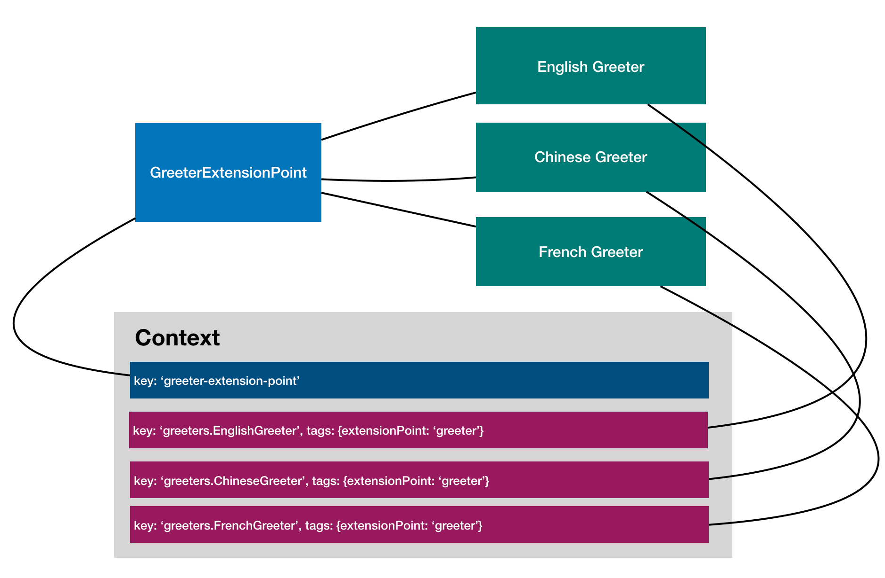

# Configuration (#7)



```ts
/**
 * A greeter implementation for Chinese.
 */
@bind(asGreeter)
export class ChineseGreeter implements Greeter {
  language = 'zh';

  constructor(
    /**
     * Inject the configuration for ChineseGreeter
     */
    @config()
    private options: ChineseGreeterOptions = {nameFirst: true},
  ) {}

```
