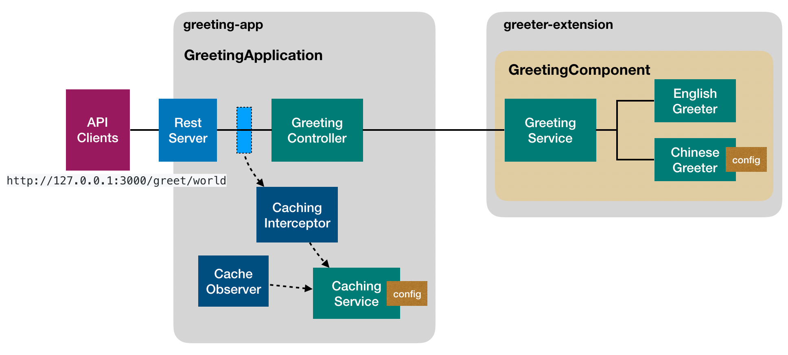

# @loopback/example-greeting-app

This application is built on top of `@loopback/example-greeter-extension`.

## Compose the application

1. Add REST API

   - GreetingController -> GreetingService

2. Caching

   - CachingInterceptor
   - CacheSweepingObserver



## Contributions

- [Guidelines](https://github.com/strongloop/loopback-next/blob/master/docs/CONTRIBUTING.md)
- [Join the team](https://github.com/strongloop/loopback-next/issues/110)

## Try out

1. As a command line

   Run `npm start -- -c` from the root folder to run the sample application. You
   should see the following message:

   ```
   English: Hello, Raymond
   Chinese: Raymond，你好
   ```

2. As a REST API Run `npm start`:

   ```
   The service is running at http://127.0.0.1:3000/greet/world
   ```

## Tests

Run `npm test` from the root folder.

## Contributors

See
[all contributors](https://github.com/strongloop/loopback-next/graphs/contributors).

## License

MIT
